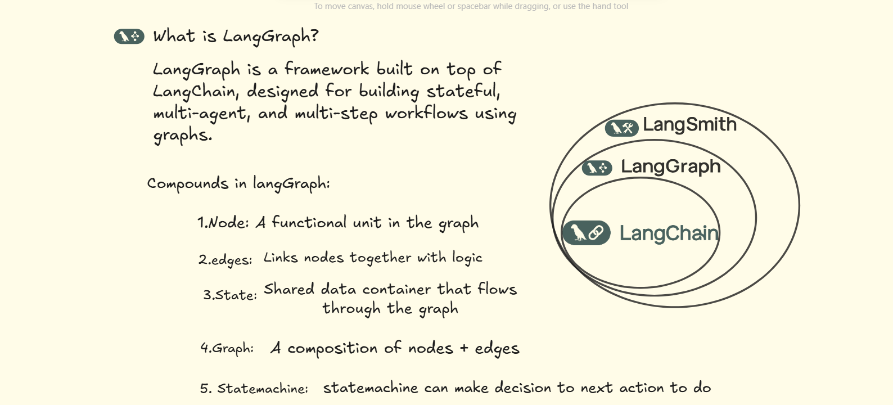

# 🌐 LangGraph Crash Course



Welcome to the **LangGraph Crash Course** – a hands-on, beginner-friendly guide to building stateful, multi-agent applications using [LangGraph](https://github.com/langchain-ai/langgraph). This course will walk you through the fundamental concepts of LangGraph and help you build real-world AI workflows with ease.

---

## 📦 What is LangGraph?

LangGraph is a powerful Python framework that combines LangChain with **state machines** and **graphs** to manage AI agent workflows. Perfect for building:
- Autonomous agents
- Human-in-the-loop systems
- Multi-step reasoning flows
- Research assistants & more!

---

## 🚀 How to Run

Install dependencies:

```bash
pip install langgraph langchain openai python-dotenv


### 2️⃣ Clone This Repository

```bash
https://github.com/Vignehwaran/LangGraph-Crash-Course.git
cd langgraph-crash-course
```

### 3️⃣ Add Your API Key

Create a `.env` file in the root folder:

```env
OPENAI_API_KEY=your_openai_api_key_here
```

### 4️⃣ Run Example

```bash
python 01_basic_graph.py
```

---


## 🎯 Course Highlights

* ✅ Understand LangGraph structure
* 🧩 Build nodes, edges, and state
* 🔄 Handle loops and conditional flows
* 👨‍💻 Implement human-in-the-loop via interrupts
* 🧠 Chain multiple LLM tools together
* ⚙️ Optimize workflows using LangGraph's memory

---

## 🔍 What You’ll Build

<p align="center">
  
</p>

You’ll create:

* A simple graph with a single node
* A graph that updates and shares state
* Conditional branching based on logic
* Interrupt-enabled graphs with human input
* Multi-agent cooperative systems using LangGraph

---

## 📚 Additional Resources

* [LangGraph GitHub](https://github.com/langchain-ai/langgraph)
* [LangGraph Docs](https://docs.langchain.com/langgraph/)
* [LangChain Framework](https://www.langchain.com)

---

## 🧠 Prerequisites

Before starting, make sure you have:

* 🐍 Python 3.9+
* 🔑 OpenAI or other LLM API Key
* 💡 Basic understanding of LangChain or LLMs

---

## 🙌 Contributing

Found a bug or want to suggest a new use-case example?
**Pull Requests and issues are always welcome!**

If you like this repo, give it a ⭐ to support the project.

---

## 🪪 License

This project is released under the **MIT License** – free to use, modify, and share.

---

## ✨ Created By

**Vigneshwaran (Vicky)**
📍 AI Developer | Data Science Enthusiast | Educator
🔗 [LinkedIn](https://www.linkedin.com/in/your-profile) | 🐦 [Twitter](https://twitter.com/your-handle)

---

> 🚀 Let’s build powerful LLM agents together using LangGraph!

```

---

✅ To finalize:
- Upload your images (`langgraph_banner.png`, `langgraph_flow.png`) to `/assets` folder.
- Replace:
  - `your-username` → your GitHub username
  - `your-profile` → your LinkedIn slug
  - `your-handle` → your Twitter/X username

Would you like me to generate the `langgraph_banner.png` and `langgraph_flow.png` now?
```
